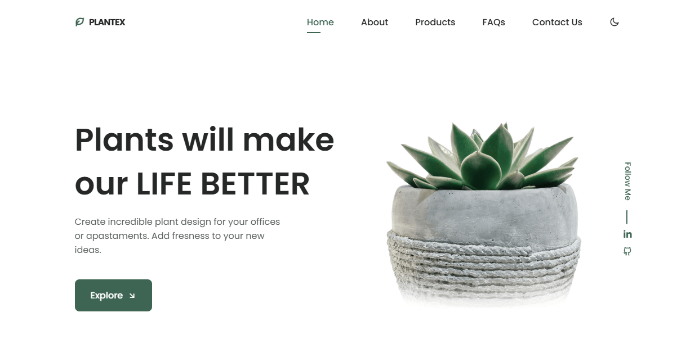

# 🌿 Plantex - Responsive Plant Shop Landing Page

Welcome to **Plantex** — a clean and modern landing page for a plant shop or interior greenery design business. This project is built using **HTML**, **CSS**, and **JavaScript**, and it is **fully responsive** across all devices including desktops, tablets, and smartphones.

---

## 🚀 Features

- ✅ Clean, modern, and minimal UI
- ✅ Fully responsive layout
- ✅ Animated CTA button
- ✅ Navigation bar with smooth interaction
- ✅ Mobile-friendly hamburger menu (optional enhancement)
- ✅ Professional typography and layout
- ✅ Social media integration (LinkedIn)

---
## Navigate into the project folder:

cd plantex-landing-page
 
Open index.html in your browser:

## You can simply double-click it, or use Live Server if you’re using VS Code.

## Site Link

https://itsme-aneek.github.io/PLANATE-X/

